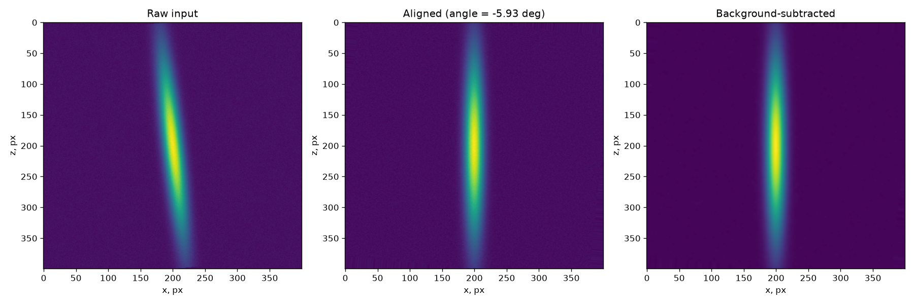
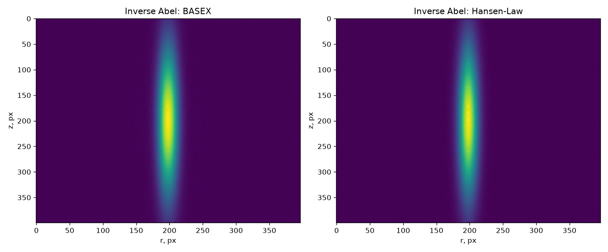
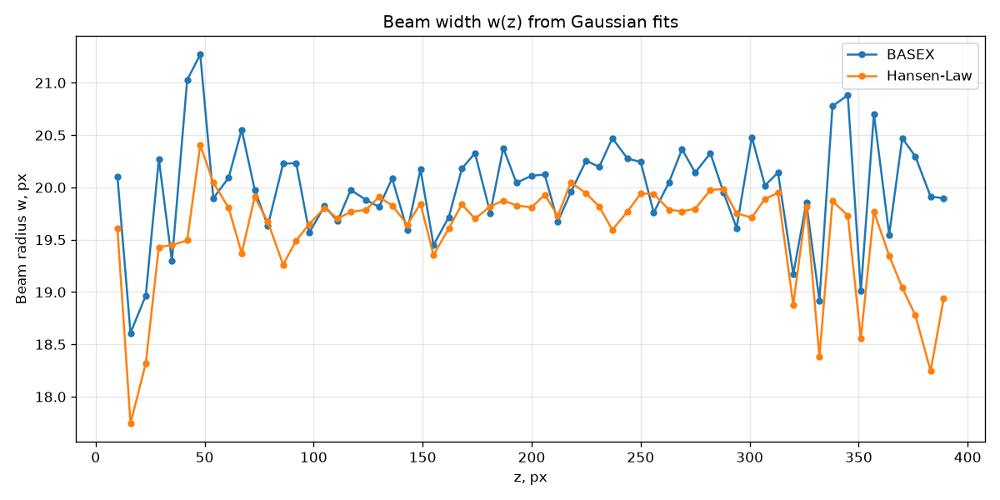
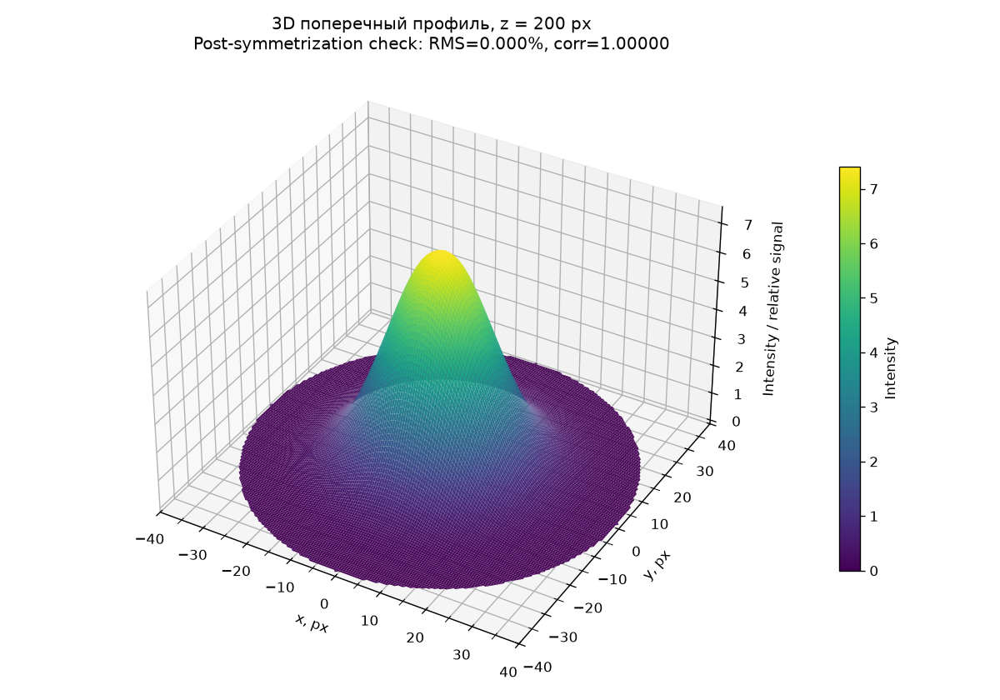

# Laser Beam Analysis

A Python pipeline for quantitative analysis of laser beam profile images.

Reconstructs the axisymmetric intensity distribution of a beam from a single
2D experimental image using inverse Abel transformation, fits radial Gaussian
profiles across the propagation axis, and reports beam width, waist position,
and Gaussian-beam propagation parameters with explicit numerical-quality
diagnostics.



*Raw input → axis-aligned → background-subtracted.*



*Independent inverse Abel reconstructions: BASEX and Hansen-Law.*



*Beam radius w(z) from Gaussian fits across the propagation axis.*



*Reconstructed 3D intensity cross-section at the central z-slice.*

---

## What it does

Given a photograph of a laser beam:

- detects the beam's longitudinal axis and aligns the image,
- removes background and estimates residual noise,
- locates the axis of symmetry (Abel origin),
- reconstructs the radial intensity distribution using **two independent
  inverse Abel methods** (BASEX and Hansen–Law) for cross-validation,
- fits Gaussian profiles across the propagation axis,
- extracts beam radius, FWHM, and Gaussian-beam propagation parameters
  (`w0`, `z0`, `zR`),
- reports explicit identifiability warnings when the model is underconstrained
  by the data,
- builds a scientific QA/QC report.

## Pipeline

```
Raw image
   ↓
Camera corrections (dark / flat)
   ↓
Beam-axis detection & alignment
   ↓
Background / noise preprocessing
   ↓
Abel-origin detection
   ↓
Left/right symmetry check
   ↓
Inverse Abel: BASEX  +  Hansen–Law
   ↓
Radial profiles  (r, z)
   ↓
Gaussian fits
   ↓
Observed waist  +  propagation model fit
   ↓
Cross-method validation & QA/QC report
```

## Installation

Requires Python 3.11 or newer.

```bash
git clone https://github.com/mrstask-cpu/laser-beam-analysis.git
cd laser-beam-analysis
python -m venv .venv

# Windows
.venv\Scripts\activate

# Unix / macOS
source .venv/bin/activate

pip install -e .
```

## Usage

```python
from laser_beam_analysis import analyze_beam

result = analyze_beam("beam_image.png")

print(result.alignment["angle_deg"])
print(result.preprocessing["background"], result.preprocessing["noise_std_after"])
print(result.symmetry["correlation"])

# Gaussian fit at a single slice:
first_ok = next(p for p in result.profiles_basex if p["success"])
print(first_ok["beam_radius_w"], first_ok["fwhm"])

# Observed waist and model-fitted propagation:
print(result.waist["basex"]["z_min_observed"], result.waist["basex"]["w0"])
print(result.propagation["basex"]["zR"])

# QA/QC audit:
print(result.audit)
```

Optional configuration (everything is optional; defaults are shown):

```python
result = analyze_beam(
    "beam_image.png",
    config={
        "calibration": {
            "enabled": True,
            "mode": "direct",
            "pixel_size": 6.5,
            "pixel_unit": "um",
            "display_unit": "um",
            "uncertainty_percent": 2.0,
            "method": "target",
        },
        "preprocessing": {"sigma": 1.5, "bg_corner_size": 40},
        "z_scan": {"mode": "dense", "n_points": 61, "margin": 10},
    },
)
```

## Why two inverse Abel methods

The inverse Abel transform is an ill-posed inverse problem: small changes in
preprocessing or in the assumed origin can significantly change the
reconstructed radial profile. Running BASEX and Hansen–Law independently and
comparing them provides a concrete numerical cross-check on the reconstruction
that a single-method pipeline cannot offer. The pipeline reports:

- per-slice relative difference between the two methods,
- mean and maximum relative difference over all valid z,
- explicit warnings when either method produces a poorly-constrained fit.

## Numerical quality and identifiability

The pipeline makes its own limits visible rather than hiding them:

- **Sensitivity analysis** over preprocessing sigma, Abel-origin offset, and
  BASEX regularization.
- **Identifiability diagnostics** on the propagation fit: R-squared, delta-BIC
  against a constant-width baseline, parameter standard deviations, and an
  explicit flag when the fitted waist `z0` falls outside the observed range.
- **Separation between two concepts** that are often conflated:
  - `z_min_observed` — the discrete minimum of `w(z)` in the data,
  - `z0` — the model-fitted waist position, which may be an extrapolation.

## Project layout

```
src/laser_beam_analysis/
    io.py              # image loading & validation
    calibration.py     # physical unit handling
    camera.py          # dark/flat corrections & saturation diagnostics
    alignment.py       # beam-axis detection & geometric alignment
    preprocessing.py   # background estimation & Gaussian smoothing
    abel_center.py     # Abel-origin detection
    symmetry.py        # left/right symmetry metrics
    abel.py            # BASEX, Hansen-Law, regularization sweep
    profiles.py        # radial profile extraction & Gaussian fitting
    z_scan.py          # z sampling & batch analysis
    propagation.py     # observed waist & Gaussian-beam propagation fit
    metrology.py       # radiometry, PSF correction, uncertainty budget
    visualization.py   # 2D and 3D plots
    results.py         # BeamAnalysisResult dataclass
    validation.py      # cross-method comparison & QA/QC report
    reporting.py       # pandas DataFrame export
    pipeline.py        # analyze_beam() entry point
tests/                 # unit and integration tests
examples/              # minimal usage notebook
notebooks/             # original research notebook (development history)
```

## Tests

```bash
pytest tests/ -v
```

## Regenerating the images above

The four figures at the top of this README are produced from a synthetic beam, not from experimental data. To regenerate them, run:

    python scripts/make_readme_images.py

Output goes to `docs/images/`.

## Status

v0.1.0 — packaging of a research prototype into a reproducible engineering
project. All stages of the pipeline are covered by unit tests; the
`analyze_beam()` entry point is covered by an end-to-end test on synthetic
input.

## License

MIT — see [LICENSE](LICENSE).
